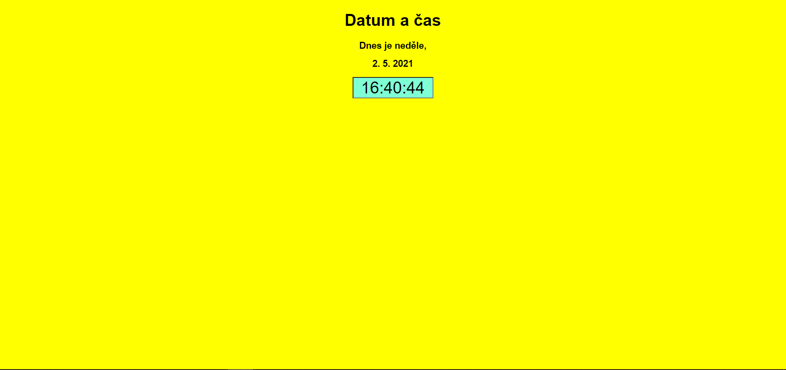

# Domácí úkol: Datum a čas

- Domácí úkol z předmětu programování a webové aplikace.
- Použítí Java scriptu, SCSS, PHP a HTML.

## Soubor style.scss

- Soubor obsahuje styly webové stránky. Vše se převádí do souboru style.css.

## Soubor index.html

Soubor obsahuje webovou stránku i s JavaScriptem.

- V prvním skriptu si zobrazujeme co je za den. Uložíme si do pole názvy dnů (Od neděle = 0 do soboty = 6). Funkcí getDay si necháme zjistit číslo dne. Poté už jen vypíšeme a přiřadíme číslo dne k číslu pole.
- Ve druhém skriptu vypisujeme datum. Použijeme funkci date(). Údaje z funkce si dáme do jednotlivých proměných (den, měsíc a rok). Datum posléze vypíšeme.
- Ve třetím skriptu si vytovříme funkční hodiny. Vytvoříme funkci tiktak, která se nám bude odpakovat minimálně 1000x. Vytvoříme si znovu proměnnou date a z data získáme hodinu, minuty a vteřiny. Aby se hodiny, minuty a vteřiny vypisovali ve formátu dvojciferného čísla použijeme podmínku. V podmínce napíšeme, aby se připsala ještě jedna nula pokud je číslo menší než 10. Nakonec vypíšeme číslo do formuláře.
- Spolupráce s Ardy Sýkora.

# Vzhled stránky

