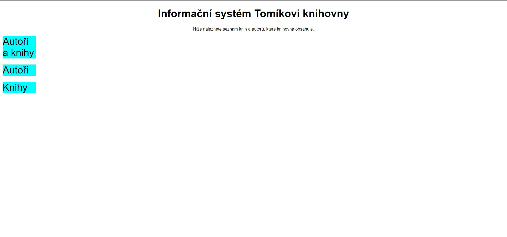
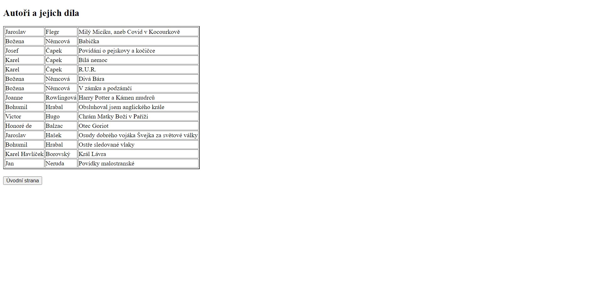
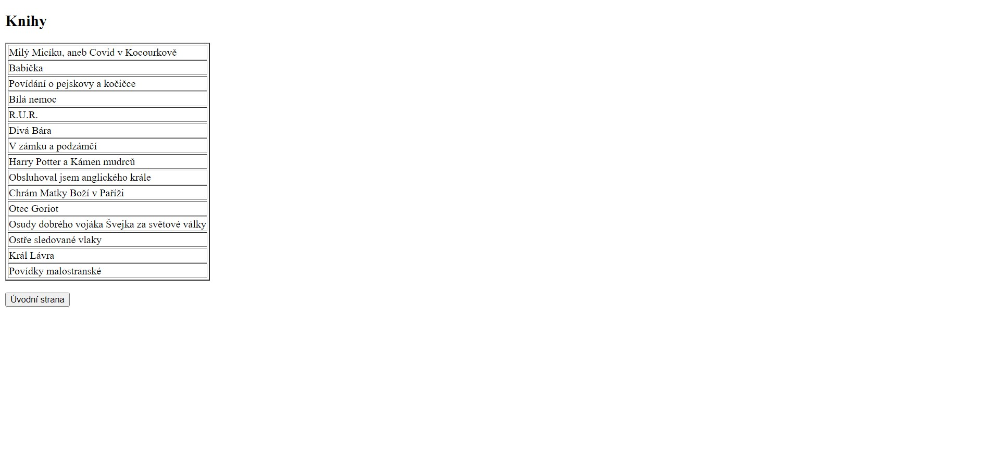
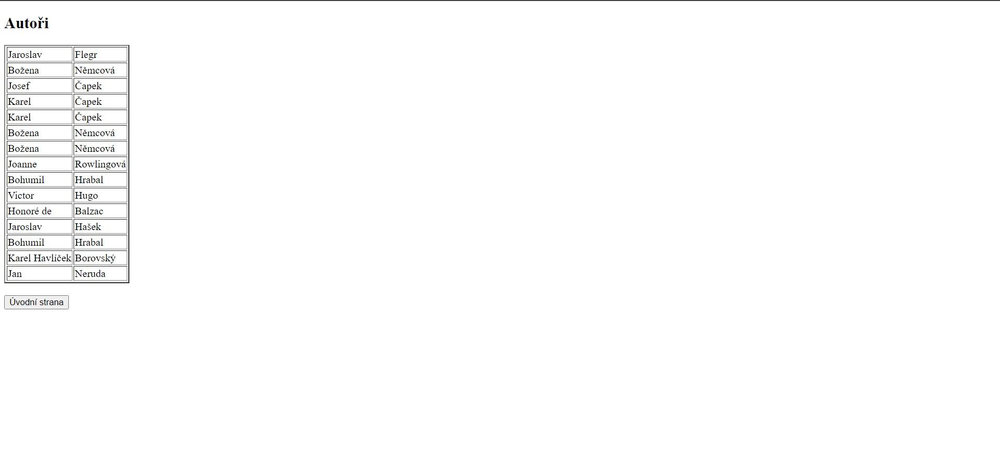

# Final project

- Závěrečný projekt z programování a webových aplikací.
- Knihovna, která vypisuje autory a jejich díla.

## Práce:

- Vytvoření databáze autorů a jejich knih.
- Zobrazení dat z databáze na webové stránce.
- Použití CSS stylů.
- Nahrání webu na hosting.
- Jazyk HTML, CSS a PHP.

## Systém souborů:

- Složka CSS obsahuje CSS soubory.
- Složka Database obsahuje databázi a další potřebné soubory.
- Složka IMG obsahuje obrázky.
- Složka PHP obsahuje všhechny PHP soubory.

## Vzhled stránky:

- Úvodní stránka knihovny.
  
- Stránka s výpisem autorů a jejich děl.
  
- Stránka s výpisem knih.
  
- Stránka s výpisem autorů.
  

## Hosting - stránka online

- Web nahrán na hostingu webzdarma.cz
- Odkaz na web [Final_project](http://autory-knihy.euweb.cz/)
