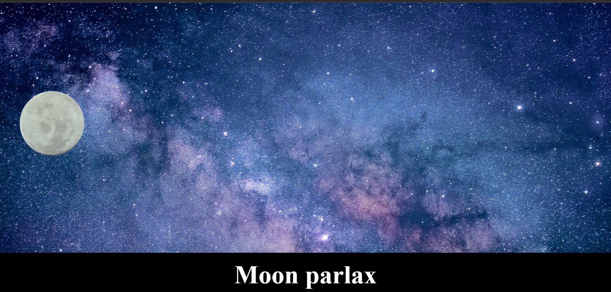
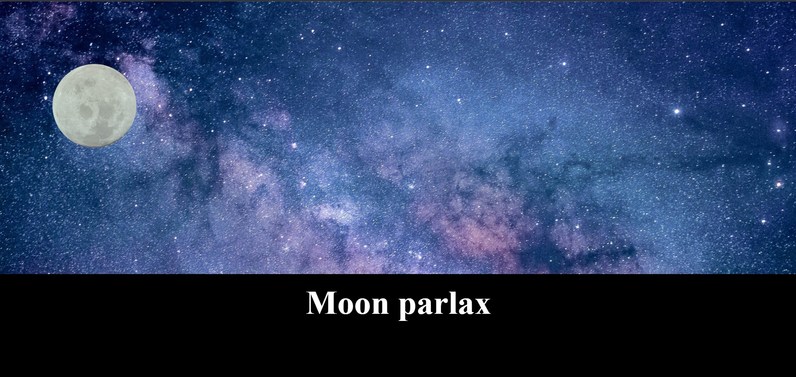

# Parlax

- Domácí úkol z předmětu programování. Vytvoření parlaxu.
- Při "scrolování" se měsíc postupně posouvá.
- Použito: HTML, css, JavaScript

## Vzhled stránky:

## Použité obrázky:

- Z webu pixabay.
- moon.jpg [Zde](https://pixabay.com/vectors/moon-big-full-moon-big-moon-1898047/)
- bg.jpg [Zde](https://pixabay.com/photos/astronomy-bright-constellation-dark-1867616/)
